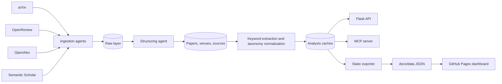

# DeepTrender


DeepTrender is a research-trend intelligence system for AI and machine
learning papers. It ingests paper metadata, normalizes venues and topics,
extracts keywords, builds trend statistics, serves Flask/MCP APIs, and exports
a static dashboard that runs directly on GitHub Pages.

Live site: https://lllllllama.github.io/DeepTrender/

## Highlights

| Capability | What is included |
| --- | --- |
| Data ingestion | arXiv, OpenReview, OpenAlex, Semantic Scholar |
| Database | SQLite with raw, structured, and analysis layers |
| Venue coverage | Configured OpenReview venues plus `data/registry/ccf_venues.csv` registry entries |
| Keyword statistics | Canonical keyword aggregation with alias merging and noise filtering |
| Trends | arXiv day/week/month/year series, venue-year keywords, global emerging topics |
| Interfaces | Static Pages dashboard, Flask REST API, MCP server |
| Automation | GitHub Actions crawl/update/export/deploy workflow |

Current local snapshot, inspected on 2026-05-21:

| Metric | Value |
| --- | ---: |
| Raw papers | 11,194 |
| Structured papers | 13,947 |
| Venues in database | 22 |
| CCF registry venues | 20 |
| Extracted keyword rows | 178,907 |
| Structured year range | 2023-2026 |

## System Diagram



## Data Model

DeepTrender keeps source evidence and derived facts separate:

| Layer | Tables / files | Purpose |
| --- | --- | --- |
| Raw evidence | `raw_papers` | Original upstream records and payloads |
| Structured records | `papers`, `venues`, `paper_sources` | Deduplicated papers and normalized venue/source links |
| Analysis facts | `paper_keywords`, `paper_topics`, `analysis_*` | Keywords, topic facts, trend caches, arXiv time series |
| Static export | `docs/data/**` | JSON files consumed by GitHub Pages |

Venue metadata is bootstrapped from `src/config.py` and extended by
`data/registry/ccf_venues.csv`. Registry-only venues are still exported to the
dashboard with `has_data: false`, so coverage gaps are visible instead of being
silently hidden.

## Keyword Policy

The dashboard uses canonical keyword statistics, not raw extractor fragments.
For example, `large language model`, `language models`, and `large language`
are counted as one canonical topic, with each paper counted once per canonical
keyword. Pure numeric extractor artifacts are filtered out of Top-K statistics.

Policy files:

| File | Role |
| --- | --- |
| `config/taxonomy/topics.yaml` | Curated canonical topics |
| `config/taxonomy/topic_aliases.yaml` | Strict serving aliases |
| `config/taxonomy/keyword_stat_aliases.yaml` | Export/statistics-only alias repair |
| `docs/data/quality/keyword_normalization_audit.json` | Raw-vs-canonical audit evidence after export |
| `docs/TAXONOMY_POLICY.md` | Taxonomy governance |
| `docs/DATA_POLICY.md` | Evidence and warning policy |

The taxonomy records external evidence such as arXiv categories, ACM CCS paths,
and Papers with Code task mappings where available. Those mappings support
normalization, but DeepTrender's curated topic list remains the serving truth.

## GitHub Pages

Pages is static-only. It does not run Flask, React, Vite, Node, or any backend
runtime. The deployable site is the `docs/` directory:

```text
src/web/static/  ->  src/tools/export_static_site.py  ->  docs/  ->  GitHub Pages
```

Export and preview locally:

```bash
python src/tools/export_static_site.py --output-dir docs --top-keywords 300
python -m http.server 8000 -d docs
```

Then open http://localhost:8000.

## Local Development

Install dependencies:

```bash
pip install -r requirements.txt
```

Run a small update:

```bash
python src/main.py --source arxiv --arxiv-days 7 --arxiv-max-results 200 --limit 200
```

Run a broad bootstrap:

```bash
python src/main.py --source all --full-crawl
```

Start the Flask app:

```bash
python src/web/app.py
```

Then open http://localhost:5000.

Start the MCP server:

```bash
python src/mcp_server.py
```

HTTP transport:

```bash
python src/mcp_server.py --transport streamable-http --port 8090
```

## GitHub Actions

Main workflows:

| Workflow | Purpose |
| --- | --- |
| `.github/workflows/update.yml` | Crawl/update data, export `docs/`, deploy Pages, commit artifacts |
| `.github/workflows/pytest.yml` | Python test suite |
| `.github/workflows/test.yml` | broader CI and smoke checks |

Important `Update Keywords` inputs:

| Input | Meaning | Default |
| --- | --- | --- |
| `source` | `arxiv`, `openalex`, `s2`, `openreview`, or `all` | `all` |
| `crawl_mode` | `auto`, `full`, or `incremental` | `auto` |
| `full_crawl_target` | Structured-paper threshold before auto mode switches to incremental | `20000` |
| `arxiv_days` | arXiv lookback window | `7`, raised in full mode |
| `arxiv_max_results` | arXiv fetch cap | resolved by workflow |
| `limit` | Processing cap | raised in full mode |
| `export_only` | Export/deploy static site without crawling | `false` |

## Repository Map

```text
deeptrender/
|-- src/
|   |-- agents/          # ingestion, structuring, analysis agents
|   |-- analysis/        # statistics and arXiv trend jobs
|   |-- database/        # SQLite schema and repositories
|   |-- extractor/       # YAKE / KeyBERT keyword extraction
|   |-- scraper/         # source clients
|   |-- services/        # topic facts, quality reports, view builders
|   |-- taxonomy/        # taxonomy loaders, resolvers, keyword canonicalizer
|   |-- tools/           # static exporter and registry import tools
|   `-- web/             # Flask app and static frontend source
|-- config/taxonomy/     # domains, topics, aliases, review queue
|-- data/                # SQLite database and venue registry
|-- docs/                # GitHub Pages static site
|-- output/              # generated figures and reports
|-- tests/               # regression tests
`-- .github/workflows/   # CI, crawl, export, deploy
```

## Tests

On Windows, run tests in UTF-8 mode:

```powershell
$env:PYTHONUTF8='1'
$env:PYTHONIOENCODING='utf-8'
python -m pytest -q
python -m compileall -q src
```

Focused checks used for the static dashboard:

```powershell
python -m pytest tests/test_export_static_site.py -q
node --check src/web/static/js/api.js
node --check src/web/static/js/main.js
```

## License

This project is released under the MIT License. See `LICENSE`.

Third-party package notes are listed in `THIRD_PARTY_NOTICES.md`. Upstream data
sources remain governed by their own terms of service and citation policies.
